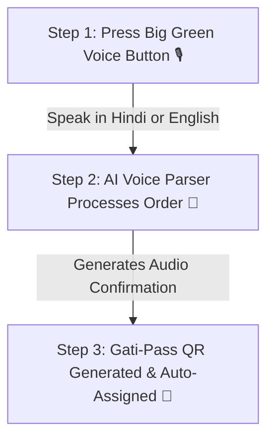
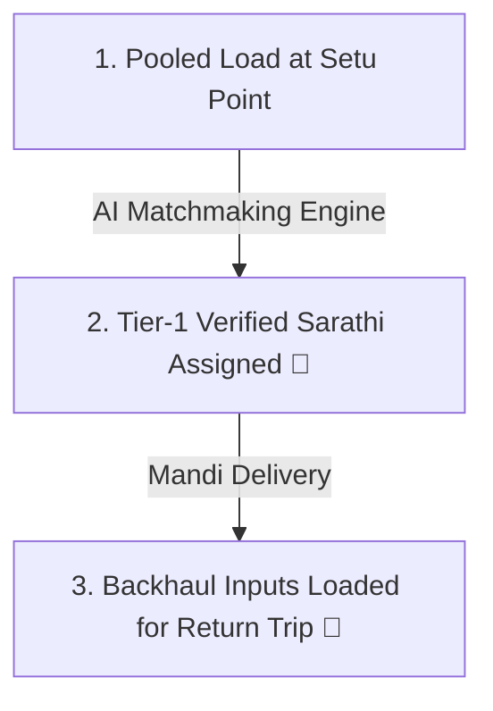

# 📖 GatiSetu Visual User Guide & Workflow 🚜🚛
> **Designed for Accessibility**: Accessible to all farmers (Kisans) and drivers (Sarathis), including non-literate users, via **Voice-First AI** and **Color-Coded Visual Workflows**.

---

## 💡 Why GatiSetu is Unique (The 3 Core Pillars)

Traditional agricultural logistics forces farmers to pay full price for half-empty trucks and lose 40-60% of earnings to middlemen. GatiSetu solves this through three revolutionary innovations:

```
┌──────────────────────────────────────────────┬──────────────────────────────────────────────┬──────────────────────────────────────────────┐
│ 🗣️ 1. Voice-First (No Typing Needed)       │ 🚜 2. Virtual Setu Point Pooling             │ 🚛 3. Dead-Mile Backhaul Subsidy            │
├──────────────────────────────────────────────┼──────────────────────────────────────────────┼──────────────────────────────────────────────┤
│ Farmers simply press a big green microphone  │ AI aggregates nearby farmer loads within     │ Returning empty trucks carry seeds &         │
│ button and speak in Hindi or English.        │ 10km to a single pickup spot (Panchayat).    │ fertilizer back to villages at 60% off.      │
└──────────────────────────────────────────────┴──────────────────────────────────────────────┴──────────────────────────────────────────────┘
```

---

## 🌾 PART 1: How a Kisan (Farmer) Books a Load

Designed so that **anyone can book a shipment in 3 simple steps without reading or writing**:



### 🎙️ Step 1: Press the Microphone & Speak
1. Open GatiSetu on any phone or tablet.
2. Click **"I am a Kisan"** (marked with a green Sprout icon 🌱).
3. Press the **Big Microphone Button** 🎙️ and speak naturally in your local language:
   > 🗣️ *"रामपुर गांव से आजादपुर मंडी के लिए 350 किलो गेहूं भेजना है"*
   > *(Or in English: "Ship 350 kg Wheat from Rampur village to Azadpur Mandi")*

---

### 🧠 Step 2: AI Reads Back Confirmation (Audio Feedback)
1. GatiSetu's Agentic LLM translates your voice into a structured shipping order.
2. The built-in **Text-to-Speech (TTS) Engine** reads back your confirmation out loud in Hindi or English:
   > 🔊 *"आपका ऑर्डर दर्ज हो गया है! 350 किलो गेहूं, रामपुर पंचायत भवन सेतु पॉइंट से पिकअप होगा।"*

---

### 📱 Step 3: Receive Your Gati-Pass QR Code
1. Your load is automatically pooled at your nearest **Setu Point** (e.g. Rampur Panchayat Bhawan).
2. A green **Gati-Pass QR Code** appears on your screen.
3. Show this QR code to the Sarathi when they arrive — no paper receipts or signature required!

---

## 🚛 PART 2: How a Sarathi (Driver) is Auto-Assigned

GatiSetu eliminates the struggle of searching for loads or driving back empty.



### 🎯 How Driver Assignment Works:
1. **Dataset-Trained Risk Engine**: The system analyzes driver performance from a **150,000-record logistics dataset** (`cancellation_risk.py`).
2. **Tier-1 Verified Assignment**: High-value pooled farmer produce is automatically assigned to drivers with $< 4.0\%$ cancellation probability.
3. **One-Stop Pickup**: The Sarathi drives to a single Setu Point (e.g., Rampur Temple Chowk) to pick up a guaranteed **100% full capacity load** instead of driving to 5 scattered farms.

---

### 🔄 The Return Trip (Dead-Mile Backhaul):
1. After unloading produce at the mandi (e.g. Azadpur Mandi), the driver does **not** return empty.
2. The app matches the returning truck with farming inputs (seeds, fertilizer, equipment) requested by village farmers.
3. **Outcome**: The driver earns extra revenue on the return trip, while farmers get essentials at a **60% discount** on freight!

---

## 📊 Quick Comparison: Traditional vs. GatiSetu

| Feature | Traditional Middlemen | GatiSetu AI Ecosystem | Benefit for Kisans & Sarathis |
|:---|:---:|:---:|:---|
| **Booking Method** | Phone call / Intermediary | **Voice Speech 🎙️ / QR Scan** | **No literacy barrier** |
| **Transport Cost** | ₹100 / km | **₹42 / km** | **58% Savings for Farmers 💰** |
| **Driver Income** | ₹15,000 / month | **₹23,800 / month** | **59% More Earnings for Drivers 🚛** |
| **Return Trips** | 60% Empty (Dead Miles) | **0% Empty (Backhaul)** | **Fuel Wasted = 0% 🌱** |
| **Driver Reliability** | Unverified / Dropouts | **Tier-1 Verified (<2% Risk)** | **98.0% Guaranteed Pickup** |

---

## ❓ Frequently Asked Questions (FAQ)

#### Q1: Do I need to be able to read or write to use GatiSetu?
**No!** GatiSetu is designed voice-first. You can book shipments, hear audio confirmations, and verify pickups using large visual icons, voice speech, and QR codes.

#### Q2: Where do farmers drop off their crops?
Loads are aggregated at Virtual **Setu Points** — recognizable local landmarks within a 10km radius (such as the village Panchayat Bhawan, Temple Chowk, or Cooperative Society).

#### Q3: How do I access the interactive Google Maps and Reliability Analytics?
Simply open [https://gati-setu.vercel.app/]() and click on the **Driver Reliability** or **Benchmark** tabs in the top navigation bar!
